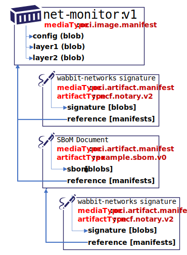

# Distribution (Experimental) with OCI Artifact Reference Support

This is an experimental fork of cncf distribution, validating the [oci.artifact.manifest spec][oci-artifact-manifest] support of reference types. Reference types are required to meet the [Notary v2 Requirements][nv2-requirements] for not changing the target digest or tag, and the [Notary v2 Scenarios][nv2-scenarios] for content movement within and across registry implementations.

## Further Reading on OCI Artifact Manifests

- [OCI Artifact Manifest Overview][oci-artifact-manifest]
- [OCI Artifact Manifest Spec][oci-artifact-manifest-spec]
- [CNCF Distribution Persistence of Reference Types](./docs/reference-types.md)
- [ORAS experimental support for oci.artifact.manifest references][oras-artifacts] to `push`, `discover`, `pull` referenced artifact types.

[oci-artifact-manifest]:  https://github.com/SteveLasker/artifacts/blob/oci-artifact-manifest/artifact-manifest.md
[oci-artifact-manifest-spec]:  https://github.com/SteveLasker/artifacts/blob/oci-artifact-manifest/artifact-manifest-spec.md
[nv2-requirements]:       https://github.com/notaryproject/notaryproject/blob/main/requirements.md
[nv2-scenarios]:          https://github.com/notaryproject/notaryproject/blob/main/scenarios.md
[oras-artifacts]:         https://github.com/deislabs/oras/blob/prototype-2/docs/artifact-manifest.md