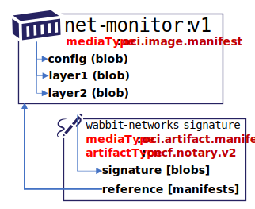

# CNCF Distribution Reference Type Support

To support [Notary v2 goals][notaryv2-goals], upload, persistence and discovery of signatures must be supported. Alternative designs were considered, as referenced in [persistance-discovery-options.md][reference-persistence-options]

This document represents prototype-2 which:

- Implements a proposed [oci.artifact.manifest][oci-artifact-manifest], utilizing a `[manifests]` collection
- Implements the [oci.artifact.manifest][oci-artifact-manifest] `/v2/_ext/oci-artifacts/v1/{repository}/manifests/{digest}/references` API to identify referenced artifacts. Such as what signatures, or SBoMs refer to a specific container image.

## Table of Contents

- [Reference Type Persistence](#reference-type-persistence)
- [Signature Discovery](#signature-discovery)
- [Persisting Referrer Metadata (Signatures)](#persisting-referrer-metadata-signatures)
- [Implementation](#implementation)

## Reference Persistence

The [oci.artifact.manifest spec][oci-artifact-manifest-spec] outlines how reference types may be added to a registry. Reference manifests support single references, such as signatures to a graph of references including signed Software Bill of Materials (SBoMs).


## Reference Discovery

Pulling content from a registry is performed via a `tag` or `digest` reference. However, reference types are considered enhancements to existing artifacts, which asks the question; how do you discover the enhancements of an artifact?

To query the artifacts which reference `net-monitor:v1`, the [oci.artifact.manifest spec][oci-artifact-manifest-spec] provides a [references api][oci-artifact-referrers-api] as an extension to the [distribution-spec][oci-distribution-spec]:  
`GET {registry}/v2/_ext/oci-artifacts/v1/{repository}/manifests/{digest}/references`

To query references of `net-monitor:v1`, with an `artifactType:application/vnd.cncf.notary.v2`, the following API would be used:  
`GET {registry}/v2/_ext/oci-artifacts/v1/net-monitor/manifests/sha256:73c803930ea3ba1e54bc25c2bdc53edd0284c62ed651fe7b00369da519a3c333/references?artifact-type=application/vnd.cncf.notary.v2`

## Persisting Reference Types

*This experimental branch* of CNCF Distribution implements reference types, enabling the ability to query reference types. To query referenced artifacts, a reverse-lookup is required. For example when referenced type is pushed, the reference is recorded in the metadata store, indexed by its artifactType.

### Put an OCI artifact by digest, linking a signature to a collection of manifests

Using the existing [OCI distribution-spec push][oci-dist-spec-manifest-put] api to push an [oci.artifact.manifest][oci-image-manifest-spec] with the added `"artifactType": "application/vnd.cncf.notary.v2"`  and a `[manifests]` reference containing the descriptor of the `net-monitor:v1` image.

```bash
DIGEST=$(sha256sum net-monitor-v1-signature.json | cut -d' ' -f1)
curl -X PUT --data-binary "@net-monitor-v1-signature.json" \
  -H "Content-Type: application/vnd.oci.artifact.manifest.v1" \
  "https://registry.wabbit-networks.io/v2/net-monitor/manifests/sha256:${DIGEST}"
```

```json
{
  "schemaVersion": 1,
  "mediaType": "application/vnd.oci.artifact.manifest.v1+json",
  "artifactType": "application/vnd.cncf.notary.v2",
  "blobs": [
    {
      "mediaType": "application/tar",
      "digest": "sha256:9834876dcfb05cb167a5c24953eba58c4ac89b1adf57f28f2f9d09af107ee8f0",
      "size": 32654
    }
  ],
  "manifests": [
    {
      "mediaType": "application/vnd.oci.image.manifest.v1+json",
      "digest": "sha256:3c3a4604a545cdc127456d94e421cd355bca5b528f4a9c1905b15da2eb4a4c6b",
      "size": 16724
    }
  ],
  "annotations": {
    "org.cncf.notary.v2.signature.subject": "wabbit-networks.io"
  }
}
```

## Implementation

Using [CNCF distribution][notaryv2-distribution], backed by file storage, the `net-monitor:v1` image is persisted as:


- **repository**: `net-monitor`
- **digest**: `sha256:73c803930ea3ba1e54bc25c2bdc53edd0284c62ed651fe7b00369da519a3c333`
- **tag**: `v1.0`
- **manifest.json**:
  ```json
  {
    "schemaVersion": 2,
    "config": {
      "mediaType": "application/vnd.oci.image.config.v1+json",
      "digest": "sha256:e752324f6804d5d0b2c098f84507d095a8fd0031cf06cdb3c7ad1625dcd1b399",
      "size": 7097
    },
    "layers": [
      {
        "mediaType": "application/vnd.oci.image.layer.v1.tar+gzip",
        "digest": "sha256:83c5cfdaa5385ea6fc4d31e724fd4dc5d74de847a7bdd968555b8f2c558dac0e",
        "size": 25851449
      },
      {
        "mediaType": "application/vnd.oci.image.layer.v1.tar+gzip",
        "digest": "sha256:7445693bd43e8246a8c166233392b33143f7f5e396c480f74538e5738fb6bd6e",
        "size": 226
      }
    ]
  }
  ```

The existing storage layout is represented as:

```bash
<root>
└── v2
    └── repositories
        └── net-monitor
            └── _manifests
                └── revisions
                    └── sha256
                        └── 73c803930ea3ba1e54bc25c2bdc53edd0284c62ed651fe7b00369da519a3c333
                            └── link
```

Push a signature as an `oci.artifact.manifest` that contains a `[blobs]` entry referencing the signature, and a `[manifests]` entry, referencing the image.



- **repository**: `net-monitor`
- **digest**: `sha256:8ac803930ea3ba1e54bc25c2bdc53edd0284c62ed651fe7b00369da519a3c222`
- **tag**: _-none-_
- **manifest.json**:
  ```json
  {
    "schemaVersion": 1,
    "mediaType": "application/vnd.oci.artifact.manifest.v1+json",
    "artifactType": "application/vnd.cncf.notary.v2",
    "blobs": [
      {
        "mediaType": "application/tar",
        "digest": "sha256:9834876dcfb05cb167a5c24953eba58c4ac89b1adf57f28f2f9d09af107ee8f0",
        "size": 32654
      }
    ],
    "manifests": [
      {
        "mediaType": "application/vnd.oci.image.manifest.v1+json",
        "digest": "sha256:3c3a4604a545cdc127456d94e421cd355bca5b528f4a9c1905b15da2eb4a4c6b",
        "size": 16724
      }
    ],
    "annotations": {
      "org.cncf.notary.v2.signature.subject": "wabbit-networks.io"
    }
  }
  ```

Using the experimental branch of CNCF Distribution, on `PUT` of an `oci.artifact.manifest` with a `[manifests]` entry, the following persistence would be made:

```
<root>
└── v2
    └── repositories
        └── net-monitor
            └── _manifests
                └── revisions
                    └── sha256
                        ├── 73c803930ea3ba1e54bc25c2bdc53edd0284c62ed651fe7b00369da519a3c333 (image manifest)
                        │   ├── link
                        │   └── ref
                        │       └── digest(application/vnd.cncf.notary.v2)
                        │           └── sha256
                        │               └── 8ac803930ea3ba1e54bc25c2bdc53edd0284c62ed651fe7b00369da519a3c222 (signature manifest)
                        │                   └── link
                        └── 8ac803930ea3ba1e54bc25c2bdc53edd0284c62ed651fe7b00369da519a3c222 (signature manifest)
                            └── link
```

> NOTE: the node immediately below `ref` is the `oci.image.manifest.artifactType` of the manifest. This node provides the indexing by `artifactType`. Since `artifactTypes` contain invalid characters for storage (`/`, `.`), the value of `oci.image.manifest.artifactType` is converted to a digest when persisted to local storage.

To represent an image which is signed, with an SBoM which is also signed, the following persistence would be made:


```
<root>
└── v2
    └── repositories
        └── net-monitor
            └── _manifests
                └── revisions
                    └── sha256
                        ├── 73c803930ea3ba1e54bc25c2bdc53edd0284c62ed651fe7b00369da519a3c333 (net-monitor:v1 image manifest)
                        │   ├── link
                        │   └── ref
                        │       └── digest(application/vnd.cncf.notary.v2)
                        │       │   └── sha256
                        │       │       └── 8ac803930ea3ba1e54bc25c2bdc53edd0284c62ed651fe7b00369da519a3c222 (net-monitor:v1 signature manifest)
                        │       │           └── link
                        │       └── digest(application/vnd.example.sbom.v0)
                        │           └── sha256
                        │               └── sb1cb130c152895905abe66279dd9feaa68091ba55619f5b900f2ebed38b222c (net-monitor:v1 sbom manifest)
                        │                   └── link
                        └── 8ac803930ea3ba1e54bc25c2bdc53edd0284c62ed651fe7b00369da519a3c222 (net-monitor:v1 signature manifest)
                        │   └── link
                        └── sb1cb130c152895905abe66279dd9feaa68091ba55619f5b900f2ebed38b222c (net-monitor:v1 sbom manifest)
                        │   └── link
                        │   └── ref
                        │       └── digest(application/vnd.cncf.notary.v2)
                        │           └── sha256
                        │               └── sb2cb130c152895905abe66279dd9feaa68091ba55619f5b900f2ebed38b222c (net-monitor:v1 sbom signature manifest)
                        │                   └── link
                        └── sb2cb130c152895905abe66279dd9feaa68091ba55619f5b900f2ebed38b222c (net-monitor:v1 sbom signature manifest)
                            └── link
```

Using the above persistence model, the individual artifacts can be found in the root of `_manifests/revisions/sha256`:

```
<root>
└── v2
    └── repositories
        └── net-monitor
            └── _manifests
                └── revisions
                    └── sha256
                        ├── 73c803930ea3ba1e54bc25c2bdc53edd0284c62ed651fe7b00369da519a3c333 (net-monitor:v1 image manifest)
                        └── 8ac803930ea3ba1e54bc25c2bdc53edd0284c62ed651fe7b00369da519a3c222 (net-monitor:v1 signature manifest)
                        └── sb1cb130c152895905abe66279dd9feaa68091ba55619f5b900f2ebed38b222c (net-monitor:v1 sbom manifest)
                        └── sb2cb130c152895905abe66279dd9feaa68091ba55619f5b900f2ebed38b222c (net-monitor:v1 sbom signature manifest)
```

With the `ref` identifying the reverse index:

```
<root>
└── v2
    └── repositories
        └── net-monitor
            └── _manifests
                └── revisions
                    └── sha256
                        ├── 73c803930ea3ba1e54bc25c2bdc53edd0284c62ed651fe7b00369da519a3c333 (net-monitor:v1 image manifest)
                        │   ├── link
                        │   └── ref
                        │       └── digest(application/vnd.cncf.notary.v2)
                        │       │   └── sha256
                        │       │       └── 8ac803930ea3ba1e54bc25c2bdc53edd0284c62ed651fe7b00369da519a3c222 (net-monitor:v1 signature manifest)
                        │       │           └── link
                        └── 8ac803930ea3ba1e54bc25c2bdc53edd0284c62ed651fe7b00369da519a3c222 (net-monitor:v1 signature manifest)
                        │   └── link
```

While not implemented in this branch, the `ref` node provides the core infrastructure for indexing, ref-counting for deletion management, and garbage collection.

[notaryv2-goals]:                 https://github.com/notaryproject/notaryproject/blob/main/requirements.md
[oci-artifact-manifest]:          https://github.com/SteveLasker/artifacts/blob/oci-artifact-manifest/artifact-manifest.md
[oci-artifact-manifest-spec]:     https://github.com/SteveLasker/artifacts/blob/oci-artifact-manifest/artifact-manifest-spec.md
[oci-image-manifest-spec]:        https://github.com/opencontainers/image-spec/blob/master/manifest.md
[oci-artifacts]:                  https://github.com/opencontainers/artifacts
[reference-persistence-options]:  https://github.com/notaryproject/nv2/blob/prototype-2/docs/distribution/persistance-discovery-options.md
[oci-artifact-referrers-api]:     https://github.com/SteveLasker/artifacts/blob/oci-artifact-manifest/manifest-references-api.md
[oci-distribution-spec]:          https://github.com/opencontainers/distribution-spec
[oci-dist-spec-manifest-put]:     https://github.com/opencontainers/distribution-spec/blob/main/spec.md#push
[notaryv2-distribution]:          https://github.com/notaryproject/distribution/tree/prototype-2
